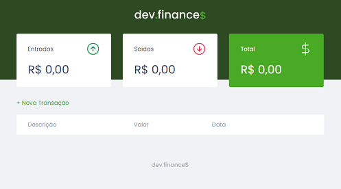
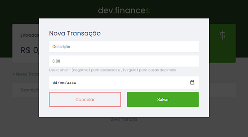
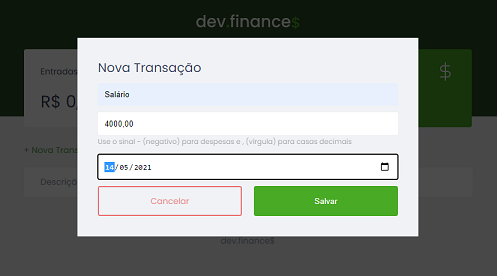
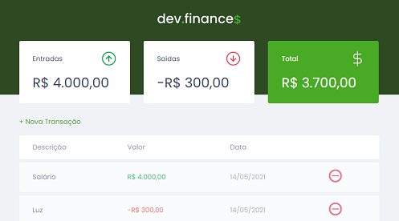

# Dev-Finance
Projeto desenvolvido durante a "Maratona Discover" da [RocketSeat](https://rocketseat.com.br/).

O Dev-Finance é uma planilha simples para cálculo de receitas e despesas. É possível adicionar e remover receitas e despesas.

## Instruções
Depois de obter o projeto no seu computador, acesse o diretório raíz do projeto e abra o arquivo `index.html`.

## Tecnlogias utilizadas
- HTML
- CSS
- JavaScript

# Screenshots

